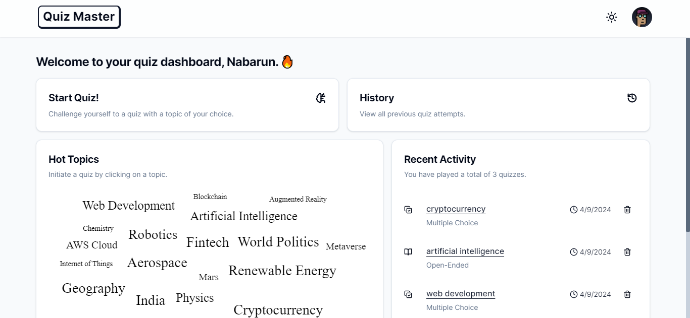

# Quiz Master

This innovative project harnesses the power of artificial intelligence (AI) to provide a dynamic and engaging quiz experience for users of all backgrounds and interests.
<em>Discover, Learn, and Quiz like never before!</em>


## Screenshot



<p align="center">
  <a href="https://quiz.nabarun.ai"><strong>View Project »</strong></a>
</p>


## Running Locally

This application requires Node.js v16.13+.

### Cloning the repository to the local machine:
```bash
git clone https://github.com/nabarvn/quiz-master.git
cd quiz-master
```

### Installing the dependencies:
```bash
npm install
```

### Running the application:
```bash
npm run dev
```


## Tech Stack:

- **Language**: [TypeScript](https://www.typescriptlang.org)
- **Framework**: [Next.js](https://nextjs.org)
- **Styling**: [Tailwind CSS](https://tailwindcss.com)
- **Analytics**: [Vercel Analytics](https://vercel.com/analytics)
- **State Management**: [React Query](https://www.npmjs.com/package/@tanstack/react-query)
- **ORM Toolkit**: [Prisma](https://www.prisma.io/docs/concepts/overview/what-is-prisma)
- **LLM Provider**: [OpenAI](https://platform.openai.com/docs/introduction)
- **Database**: [PlanetScale](https://planetscale.com/docs/concepts/what-is-planetscale)
- **Authentication**: [NextAuth.js](https://next-auth.js.org/getting-started/introduction)
- **Deployment**: [Vercel](https://vercel.com)


## Credits

This project is highly inspired from one of Elliott Chong's awesome builds. His work is really dope!

<hr />

<div align="center">Don't forget to leave a STAR 🌟</div>

